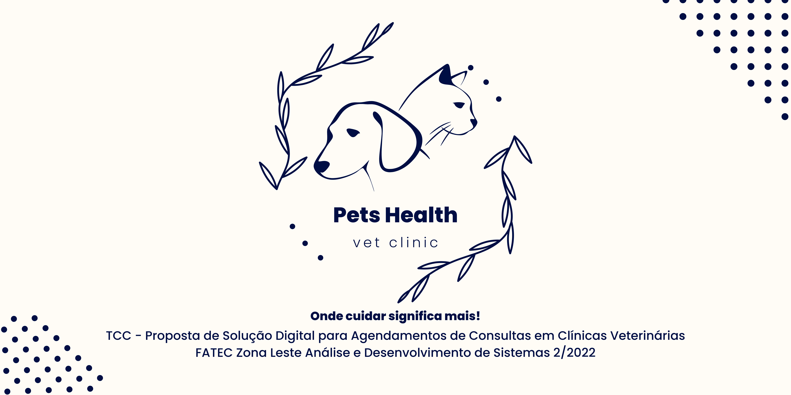
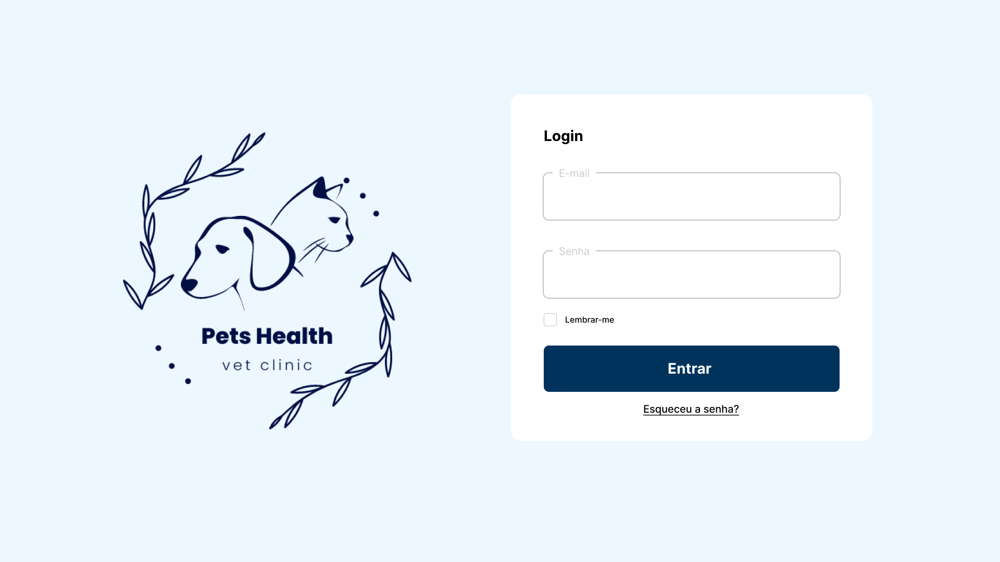
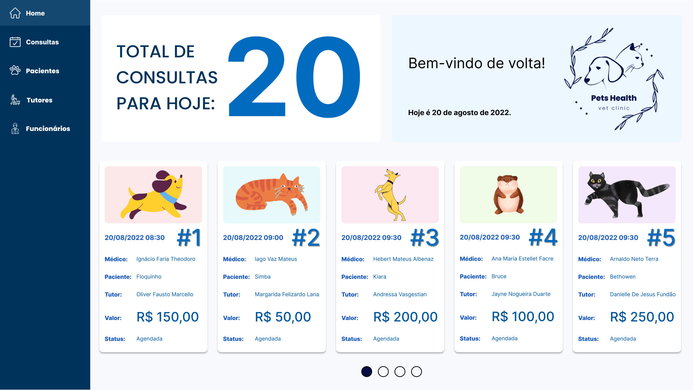
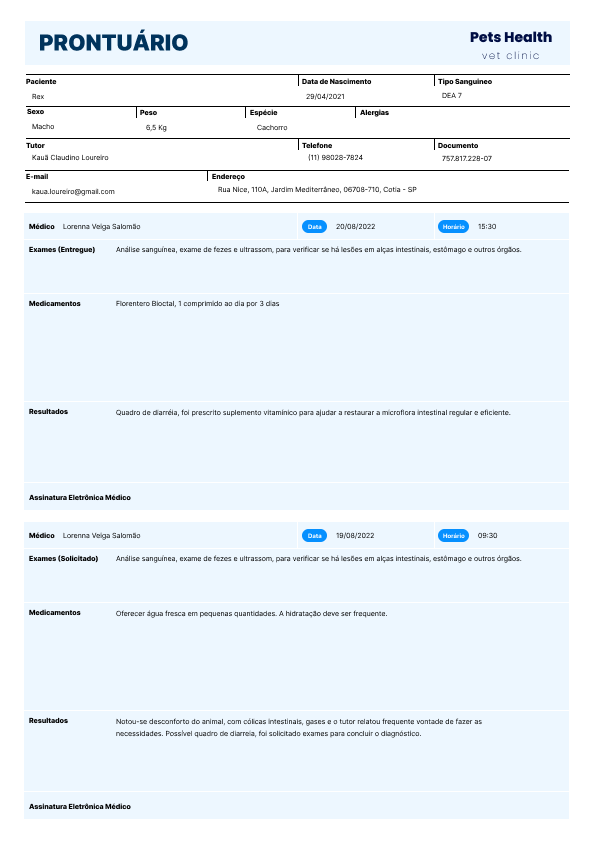

  
  
  
   

<h1 align="center">
    
</h1>

<h3 align="center"> 
  
</h3>

 <a href="#-sobre-o-projeto">Sobre</a> •
 <a href="#-funcionalidades">Funcionalidades</a> •
 <a href="#-layout">Layout</a> • 
 <a href="#-tecnologias">Tecnologias</a> • 
 <a href="#-contribuidores">Contribuidores</a>

## 💻 Sobre o projeto

🐶 Pets Health - é um projeto de conclusão de curso, no qual consiste em um sistema para gerência de clínica veterinária.

O Projeto foi realizado durante o ano de 2022 sob orientação do professor [Leandro Colevati dos Santos](https://github.com/lecolevati).

---
## ⚙️ Funcionalidades

- [x] Login Administrador e Funcionário
- [x] Cadastro de Funcionários
- [x] Redefinir Senha
- [x] Gerenciar Consultas
- [x] Gerenciar Pacientes
- [x] Gerenciar Tutores
- [x] Gerenciar Funcionários
- [x] Gerar PDF e Impressão de Prontuário

---

## 🎨 Layout

O layout da aplicação está disponível no Figma:

  
  
  

---

## 🛠 Tecnologias

As seguintes tecnologias e ferramentas foram usadas na construção do projeto:

  - HTML
  - CSS
  - [TypeScript](https://www.typescriptlang.org/)
  - [React](https://pt-br.reactjs.org/)
  - [Material UI](https://mui.com/pt/)
  - [ESLint](https://eslint.org/)
  - [Yarn](https://yarnpkg.com/)
  - [Node.js](https://nodejs.org/en/)
  - [Express](https://expressjs.com/)
  - [npm](https://www.npmjs.com/)
  - [MongoDB](https://www.mongodb.com/)
  - [Docker](https://www.docker.com/)
  - [Docker Compose](https://docs.docker.com/compose/)
  - [Amazon EC2](https://aws.amazon.com/pt/ec2/)
  - [Nginx](https://www.nginx.com/)
  - [Figma](https://www.figma.com/) → [Protótipo (TCC)](https://www.figma.com/file/8K7nK20bwcnGD54uCLUdUh/TCC)
  - [Visual Studio Code](https://code.visualstudio.com/)

---

## 👨‍💻 Contribuidores
